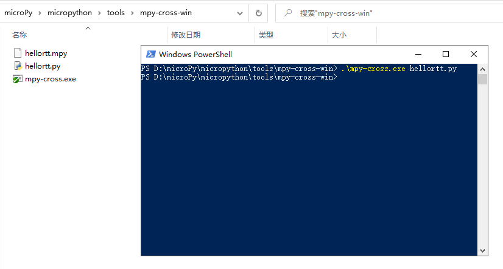

## 使用 mpy-cross.exe 工具

在某些需求场合下， Python 可以编译成 .pyc 字节码文件，使用这类预先编译好的二进制文件，可以一定程度上保护源代码，同时可以提高程序的加载速度。在 micropython 中同样地提供了类似的功能，能够将 .py 文件编译成 .mpy 文件。下文将使用**潘多拉开发板/ stm32 F411 Nucleo **开发 .mpy 示例工程。

### 生成 mpy 文件

micropython 官方 git 源码中，提供了可供编译的 mpy-cross 源码，方便开发者编译自己系统环境的 mpy-cross 软件。

针对 windows 平台，有两种常见运行 mpy-cross 方式：

- 使用 msys 或 cygwin 这类小型 GNU 环境，能够使用 bash 和 make ，不过需要拖带庞大的运行时库，且速度较慢。

- 直接适配 windows 平台编译并运行 mpy-cross.exe ，无需拖带环境，轻量且速度快。

为了便捷，本文将在 windows 环境中，使用软件包中提供的 mpy-cross.exe 软件。

在 RT-Thread/micropython 项目里找到 tools 文件夹，下载 mpy-cross.exe 。

这里以 `helloRTT.py` 示例：

```python
class HELLORTT:
  def __repr__(self):
     self.__call__()
     return ""

  def __call__(self):
     print("--helloworld!!")
     print("--helloRTT")

hello = HELLORTT()
```

首先将需要被编译的 ` helloRTT.py `文件拖入到 mpy-cross.exe 所在文件夹中，在按住shift键的同时，点击鼠标右键，选择`在此处打开 Powershell 窗口`（ cmd 窗口在这里也是可以使用的）。然后在 Powershell 中，键入`.\mpy-cross.exe ` 后面接上需要编译的工程`helloRTT.py`：



此时如果编译成功，将会生成mpy文件。如上图编译成功，在文件夹中生成了`helloRTT.mpy`文件。我们将`helloRTT.mpy`拷贝到MCU的文件系统上，便可以像 .py 文件一样被 import 并调用。

### 拷贝至MCU文件系统中

将生成好的 .mpy 文件，拷贝至 MicroPython IDE 的工程中，并选中它，右键下载到MCU中，如图：


当下载完成之后，便可以在串口命令行中尝试 import 该 mpy 文件，执行该文件的函数，确认能够正常使用：


如果运行时出现`“ValueError: invalid .mpy file”`错误，有可能是 MCU上 的 micropython 固件与 mpy-cross 所在的版本固件不相符（当前使用的是v1.12版本），需要使用相同版本的 mpy-cross 软件，或 MCU 使用相同版本的固件， mpy 文件才能正常运行。