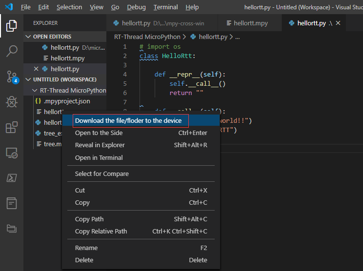

## 使用mpy-cross.exe工具生成.mpy文件

在以往的开发经验中，我们知道了Python可以编译成.pyc字节码文件，这类预先编译好的二进制文件可以一定程度上保护我们的源代码，同时可以提高程序的加载速度。micropython中同样地提供了类似的功能，能够将我们的.py文件编译成.mpy文件。我们将以**潘多拉开发板/stm32 F411 Nucleo**开发板作为本文的示例主板。

### 生成mpy文件

**注意：**在micropython官方git源码中，提供了可供编译的mpy-cross源码，方便开发者自行编译适配自己系统环境的mpy-cross软件，本文就windows便捷使用角度，作为编译.mpy示例。

*目前针对windows平台，使用mpy-cross较为友好的方式有两种：一种是使用msys或者cygwin这类小型GNU环境，优势是能够使用bash和make，在我们想要转换mpy文件的使用角度上，这种方式在windows中并不便捷。另一种是直接适配windows平台编译并使用mpy-cross.exe，无需拖带环境，直接上手使用。*

我们接下来就以我们软件包里提供的mpy-cross.exe（基于**官方v5版本**）演示如何编译并在开发板上执行为例，Linux用户参照micropython官方源码mpy-cross文件夹中的README.md自行编译。

这里以 `helloRTT.py` 示例：

```python
class HELLORTT:
  def __repr__(self):
     self.__call__()
     return ""

  def __call__(self):
     print("--helloworld!!")
     print("--helloRTT")

hello = HELLORTT()
```

首先将需要被编译的 `helloRTT.py`文件拖入到mpy-cross-win文件夹中，在按住shift键的同时，点击鼠标右键，选择`在此处打开Powershell窗口`，当然cmd窗口在这里也是可以使用的。然后在Powershell中，键入`.\mpy-cross.exe ` 后面接上我们的工程`helloRTT.py`：


此时如果编译成功，将会生成mpy文件，上图编译成功，在文件夹中生成了`helloRTT.mpy`文件。我们将helloRTT.mpy拷贝到MCU的文件系统上，便可以像.py文件一样被import并调用。

### 拷贝至MCU文件系统中

将生成好的.mpy文件，拷贝至MicroPython IDE的工程中，并选中它，右键下载到MCU中，如图：



当下载完成之后，便可以在串口命令行中尝试import该mpy文件，执行该文件的函数，确认能够正常使用：


 **注意：** 如果运行时出现“ValueError: invalid .mpy file”错误，有可能是MCU上的micropython固件与mpy-cross所在的版本固件不相符（当前使用的是v1.12版本）